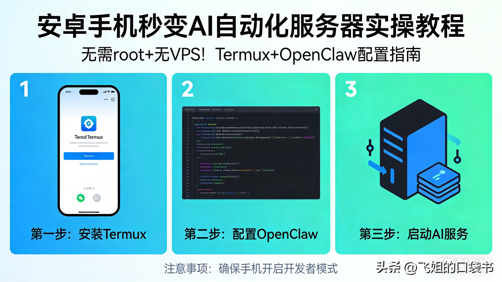

# 





# 一、别再浪费安卓手机！它居然能替代千元AI服务器


谁能想到，我们每天揣在兜里的安卓手机，居然能跳出“通讯工具”的局限，变身一台能跑Gemini模型、连WhatsApp的AI自动化网关？不用花钱租VPS，不用冒险给手机root，甚至不用复杂的专业知识，只要一个Termux软件，就能轻松实现。


很多人买了高性能安卓机，只用它刷视频、聊微信，却忽略了它的潜在算力——如今一台中端安卓机的配置，足以支撑轻量AI自动化需求，而租一台基础VPS每月还要几十上百元，root手机又会失去保修、增加安全风险。


有人会质疑：手机跑AI服务器，真的稳定能用吗？非专业人士能操作成功吗？其实只要找对方法，避开几个关键坑，哪怕是新手，也能在1小时内完成搭建，既省钱又灵活，看完这篇，你再也不会浪费手机的多余算力。


先给大家说清核心亮点：全程无root、无VPS依赖，用Termux搭载Ubuntu系统，再安装OpenClaw，就能实现AI模型调用+社交软件联动，所有工具全免费、开源，普通人零成本就能上手，真正做到“把AI服务器装进口袋”。


# 二、一步不差，手把手教你搭建安卓AI自动化服务器


搭建的核心逻辑很简单：用Termux在安卓手机上模拟Linux环境（Ubuntu），再在Ubuntu里安装OpenClaw及相关依赖，配置Gemini免费API和WhatsApp通道，最后用tmux保持后台稳定运行，全程跟着步骤来，零踩坑。


# 关键技术补充


本文核心用到两个关键工具，均为开源免费，门槛极低：


1. Termux：一款安卓端终端模拟器，可在手机上搭建轻量Linux环境，无需root，开源免费，GitHub星标高达11.8万+，支持多种Linux发行版安装，是手机玩机、轻量开发的必备工具。


2. OpenClaw：一款开源AI自动化网关，支持对接Gemini、GPT等多种AI模型，可联动WhatsApp、Telegram等社交软件，实现自动化回复、指令执行等功能，开源免费，无任何付费门槛，适配多种系统环境。


# 前期准备


一部安卓手机（安卓8.0及以上即可，配置越高越流畅）、稳定的网络、足够的存储空间（至少预留1GB，用于安装系统和依赖），无需root，无需额外硬件。


# 步骤1：正确安装Termux（避坑首选）


重点提醒：千万别从应用商店安装Termux！应用商店版本过于老旧，存在诸多bug，会导致后续搭建全部失败，这是很多新手最容易踩的坑。


正确安装方法：从F-Droid平台下载Termux，安装完成后，打开Termux，输入以下命令更新所有组件，打造干净新鲜的运行环境：


```javascript
pkg update && pkg upgrade -y
```


输入命令后，等待自动更新完成，期间无需手动操作，出现确认提示时，直接按回车即可。


# 步骤2：在Termux中安装Ubuntu系统


OpenClaw需要在完整的Linux环境中运行，因此我们需要在Termux中安装Ubuntu系统（通过proot-distro实现，无需root，模拟完整Linux用户环境），步骤如下：


1. 安装proot-distro（用于安装Linux发行版）：


```javascript
pkg install proot-distro -y
```


2. 安装Ubuntu系统：


```javascript
proot-distro install ubuntu
```


3. 登录Ubuntu系统：


```javascript
proot-distro login ubuntu
```


登录成功后，终端会显示“root@localhost:~#”，这就说明你的安卓手机已经成功模拟成Linux系统，接下来所有操作都在这个界面进行。


# 步骤3：安装Ubuntu系统依赖


进入Ubuntu系统后，首先需要安装OpenClaw运行所需的基础依赖（curl、git、开发工具等），输入以下两条命令，依次执行：


```javascript
apt update && apt upgrade -y
```


```javascript
apt install curl git build-essential -y
```


两条命令执行完成后，基础开发工具和依赖就安装好了，为后续安装Node.js和OpenClaw做好准备。


# 步骤4：安装Node.js 22（OpenClaw最佳适配版本）


OpenClaw对Node.js版本有明确要求，最佳适配版本为Node.js 22，因此我们需要手动安装该版本，步骤如下：


1. 添加Node.js 22软件源：


```javascript
curl -fsSL https://deb.nodesource.com/setup_22.x | bash -
```


2. 安装Node.js 22：


```javascript
apt install -y nodejs
```


3. 验证安装是否成功（查看Node.js版本）：


```javascript
node -v
```


如果终端显示“v22.x.x”（x为具体版本号），说明安装成功；若未显示，可重新执行上述步骤。


# 步骤5：安装OpenClaw（核心AI自动化工具）


Node.js安装完成后，即可安装OpenClaw，输入以下命令，将其全局安装（全局安装后，可在任意目录调用）：


```javascript
npm install -g openclaw@latest
```


安装过程需要一定时间，取决于网络速度，期间不要关闭Termux，耐心等待安装完成即可。


# 步骤6：关键修复——解决安卓“System Error 13”崩溃问题


这是安卓手机搭建的核心坑点，很多教程都会跳过这一步，导致OpenClaw启动后直接崩溃，报错“System Error 13”。原因是安卓系统限制了os.networkInterfaces()调用，我们需要通过简单的配置绕过这个限制。


修复步骤（全程在Ubuntu环境中执行）：


1. 创建一个override文件（用于劫持Node.js调用）：


```javascript
cat < /root/hijack.js
const os = require('os');
os.networkInterfaces = () => ({});
EOF
```


2. 配置自动加载该文件，确保每次启动OpenClaw时都能生效：


```javascript
echo 'export NODE_OPTIONS="-r /root/hijack.js"' >> ~/.bashrc
source ~/.bashrc
```


配置完成后，OpenClaw就能正常启动，不会再出现崩溃问题，这一步必须执行，缺一不可。


# 步骤7：首次启动OpenClaw，配置Gemini免费API


修复完成后，即可启动OpenClaw的引导模式，进行初始化配置（引导模式能帮助我们快速配置AI模型、社交通道，适合新手），步骤如下：


1. 启动引导模式：


```javascript
openclaw onboard
```


启动后，终端会显示“◇ Onboarding mode │ QuickStart”，进入配置界面。


2. 选择AI模型（免费首选Gemini）：


当提示“Model/auth provider”时，选择“Google”；接着提示“Google auth method”时，选择“Google Gemini API key”（免费、无门槛，无需信用卡）。


3. 获取免费Gemini API key：


进入官方平台，登录自己的Google账号，点击“Get API key”，创建一个新的API key，即可免费获取（有 generous 免费额度，足够个人使用，无需付费）。


4. 配置API key：


将获取到的Gemini API key粘贴到Termux的提示框中，系统会自动保存，无需手动记录。粘贴完成后，选择“google/gemini-3-flash-preview”模型，其余配置保持默认，点击继续即可。

 


```shell
相关问题：
1、termux 中 openclaw gateway 没有连接

> 执行 openclaw gateway start


2、openclaw gateway start 启动若报错
则
export XDG_RUNTIME_DIR="$TMPDIR"
export DBUS_SESSION_BUS_ADDRESS="unix:path=${XDG_RUNTIME_DIR}/bus"
设置好环境后，直接调用启动命令，不要通过 gateway start 这种服务管理命令：
openclaw gateway run
如果提示 openclaw: command not found，请先执行 source $HOME/.bashrc 或重新打开 Termux。
```


# 步骤8：选择社交通道（以WhatsApp为例）


配置完AI模型后，会进入通道选择界面，显示多种社交平台选项，包括Telegram、WhatsApp、Discord等，我们以最常用的WhatsApp为例，选择“WhatsApp（QR link）”，按照提示完成绑定即可（绑定过程需扫描二维码，确保手机已安装WhatsApp）。


# 步骤9：配置tmux，实现后台持久运行


如果直接关闭Termux，OpenClaw会停止运行，因此我们需要用tmux工具创建持久化会话，确保即使关闭Termux，AI服务器也能在后台稳定运行，步骤如下：


1. 新建一个Termux窗口（不要关闭之前的Ubuntu窗口），安装tmux：


```javascript
pkg install tmux -y
```


2. 防止手机休眠（确保后台运行不中断）：


```javascript
termux-wake-lock
```


3. 创建tmux会话（命名为claw，方便后续查找）：


```javascript
tmux new -s claw
```


4. 在tmux会话中，启动OpenClaw网关：


```javascript
proot-distro login ubuntu
openclaw gateway --verbose
```


执行完成后，即使关闭Termux，OpenClaw也会在后台持续运行，实现AI服务器的持久化。


# 补充：手动获取网关令牌


启动OpenClaw网关后，系统会自动生成一个网关令牌，用于浏览器登录管理。如果不小心错过终端显示的令牌，可通过以下命令手动获取（在Ubuntu环境中执行）：


```javascript
cat /root/.openclaw/openclaw.json | grep "token"
```


执行后，终端会显示类似“"token": "104cb8ff9257d79f99581089cd205cc0b5d4"”的内容，引号中的字符串即为网关令牌。


# 浏览器登录管理


获取令牌后，打开手机或电脑浏览器，输入“[http://localhost:18789”，当提示需要身份验证时，粘贴获取到的网关令牌，即可登录OpenClaw管理界面，进行后续的AI自动化配置。](http://localhost/:18789”，当提示需要身份验证时，粘贴获取到的网关令牌，即可登录OpenClaw管理界面，进行后续的AI自动化配置。)


# 三、手机变AI服务器，优势突出但也有局限


不可否认，用安卓手机搭建AI自动化服务器，是普通人零成本玩转AI自动化的绝佳路径，但其优势与局限并存，理性看待，才能更好地发挥其价值，避免盲目跟风。


从优势来看，它完美解决了普通人的核心痛点：零成本（无需租VPS、无需付费工具）、零门槛（无需root、步骤简单，新手可上手）、高灵活（手机随身携带，随时随地可管理，无需固定设备）、易操作（全程命令行复制粘贴，无需专业开发知识）。对于个人用户、新手玩家来说，用来实现轻量AI自动化需求（如WhatsApp自动回复、简单指令执行、Gemini模型调用），完全足够，性价比远超租VPS。


但我们也要清醒地认识到它的局限：首先，性能有限，安卓手机的算力和内存无法与专业服务器、甚至普通电脑相比，无法支撑高强度、高并发的AI任务，比如大规模数据处理、复杂模型训练等，仅适合轻量使用；其次，稳定性受影响，手机一旦关机、断网，或者被清理后台（即使有tmux保护，极端情况下仍可能中断），AI服务器就会停止运行，不适合需要24小时不间断运行的场景；最后，兼容性有局限，部分复杂的AI模型和自动化脚本，可能无法在手机模拟的Linux环境中正常运行，适配性不如专业服务器。


因此，我们无需神化这种搭建方式，也不必否定其价值——它不是专业服务器的替代品，而是普通人低成本尝试AI自动化、玩转手机算力的“入门工具”。明确自己的需求，若只是个人轻量使用，它绝对是最优解；若需要高强度、高稳定的运行环境，租VPS或使用专业服务器，才是更靠谱的选择。


# 四、现实意义：普通人也能零成本拥抱AI自动化


在AI普及的当下，很多人觉得“AI自动化”是专业人士的专属，需要高昂的设备成本、专业的技术知识，普通人难以触及。而安卓手机+Termux+OpenClaw的组合，恰恰打破了这种壁垒，让普通人也能零成本拥抱AI自动化，其现实意义远超“玩机”本身。


对于新手玩家和学生来说，这种搭建方式，是学习Linux系统、AI工具使用、自动化配置的绝佳实践场景——不用花钱买设备，不用搭建复杂环境，在手机上就能亲手操作，快速掌握相关技能，为后续深入学习AI、编程打下基础；对于个人用户来说，可利用搭建的AI服务器，实现多种实用功能：WhatsApp自动回复客户咨询、定时执行指令、调用Gemini模型生成文案、翻译内容等，节省时间和精力，提升效率；对于创业者、自由职业者来说，零成本搭建轻量AI自动化工具，可用于简单的客户对接、内容生成，无需投入额外成本，降低创业和工作门槛。


更重要的是，这种方式传递了一种理念：AI自动化并非遥不可及，只要找对方法，利用身边现有的设备，普通人也能玩转AI，让AI成为自己的“帮手”。它不追求高性能、高并发，只追求“实用、低成本、易操作”，恰恰契合了普通人对AI自动化的核心需求——无需专业，够用就好。


# 五、互动话题：你会用手机搭建AI服务器吗？


看完这篇实操教程，你觉得用安卓手机搭建AI自动化服务器，实用吗？你已经动手尝试了吗？搭建过程中遇到了哪些问题？


欢迎在评论区留言交流，分享你的搭建经验、踩坑经历，也可以说说你打算用这个AI服务器实现什么功能——是自动回复、文案生成，还是学习Linux、AI相关技能？


另外，如果你有更好的手机AI玩机技巧、零成本AI工具推荐，也欢迎在评论区分享，帮助更多普通人零成本玩转AI自动化！

